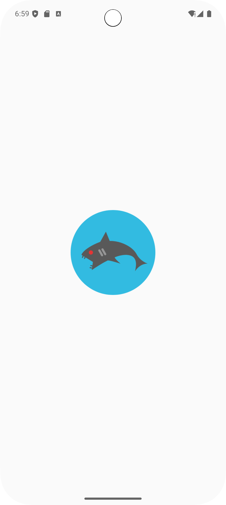
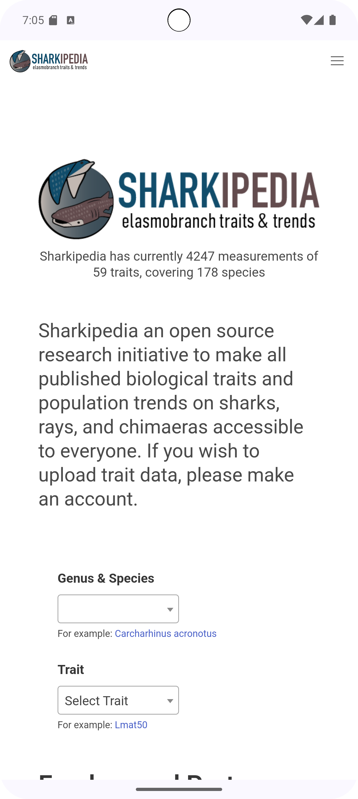

# SharkyApp 🦈

SharkyApp is an Android application designed to provide an optimized browsing experience for the [Sharkipedia](https://www.sharkipedia.org/) website, an organization dedicated to shark conservation and education.

## Features

- **Integrated WebView**: The app uses a WebView component to display Sharkipedia's content directly within the app.
- **Modern Design**: Implements Material Design 3 with Jetpack Compose for a modern and smooth user experience.
- **JavaScript Support**: Enables JavaScript in the WebView to ensure full functionality of the website.
- **Updated System Requirements**: Requires Android Studio Flamingo (2024.3.1 Patch 1) or later, Gradle 8.0 or later, and a device or emulator running Pixel 8 Pro (API 35) or higher.

## Media

     
    

## System Requirements

- Android Studio later (2024.3.1 Patch 1).
- Gradle 8.0 or later.
- Device or emulator running Pixel 8 Pro (API 35) or higher.
